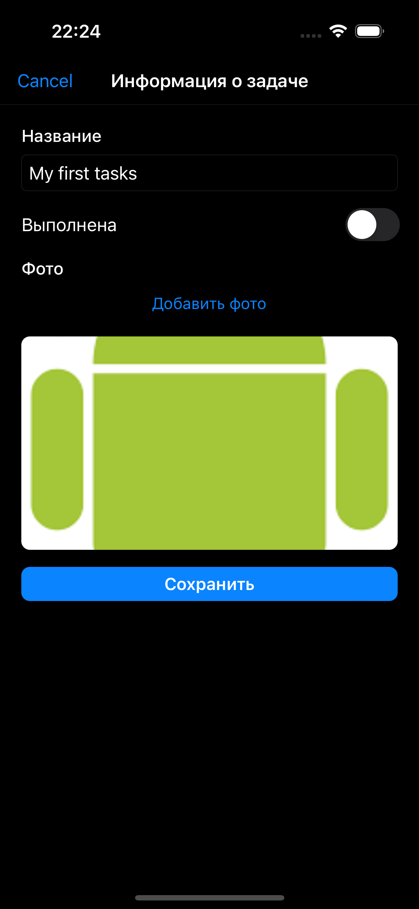

# Task App

Приложение по ведению задач. Это элегантное приложение для управления задачами, которое помогает вам сосредоточиться на самом важном.

## ✨ Ключевые возможности

### 🎯 Основные функции
- **Просмотр задач** — просмотр информации по задачам и их статусу выполнения
- **Создание задач** — ввод новой задачи с возможностью приложения изображения из галереи
- **Редактирование задач** — возможность редактирования задач

При отсутствии интернет-соединения информация по задачам кешируется. При появлении интернет-соеинения задачи синхронизируются с сервером. 

### Требования
- iOS 16.0+

### Стек
- UI: UIKit
- Архитектура: MVVM + Coordinator
- Инструменты: Combain
- Локальное хранилище: CoreData

**Screenshots :**

